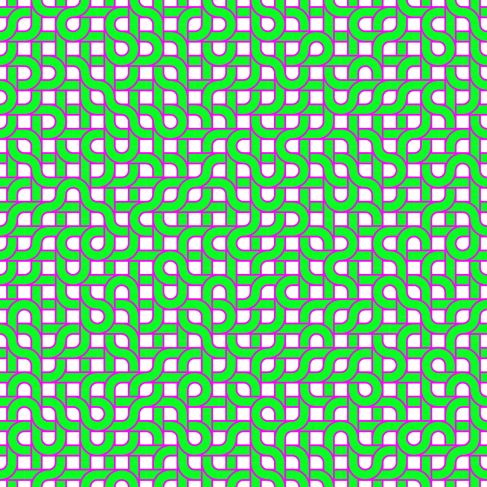
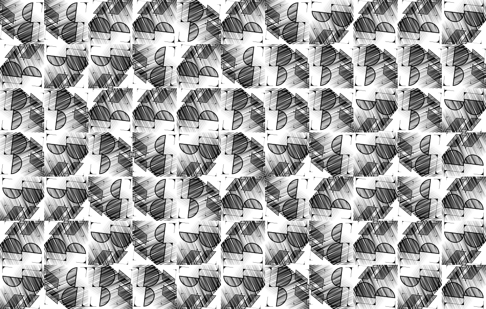

# patterns

`patterns` is a pattern generating toolkit built in Clojure. At _Be Nice Now_, we use this to generate the patterns we use for our prints and textiles.

## Installation

TODO: Clojars

## Usage

### Tiling

```clj
(core/render
  "./pipes-tiled_3_3.svg"
  (-> "pipes.svg"
      clojure.java.io/resource
      slurp
      hiccup/svg->hiccup
      (tile/grid 3 3)))

(core/render
  "./bnn-logo-rotated_11_7.svg"
  (-> "bnn-logo.svg"
      clojure.java.io/resource
      slurp
      hiccup/svg->hiccup
      (tile/grid
        11 7
        {:transform-fn tile/rotate})))
```

## Examples

### Basic Tiling


### Tiling with Rotation






## License
Distributed under the Eclipse Public License either version 1.0 or (at
your option) any later version.
